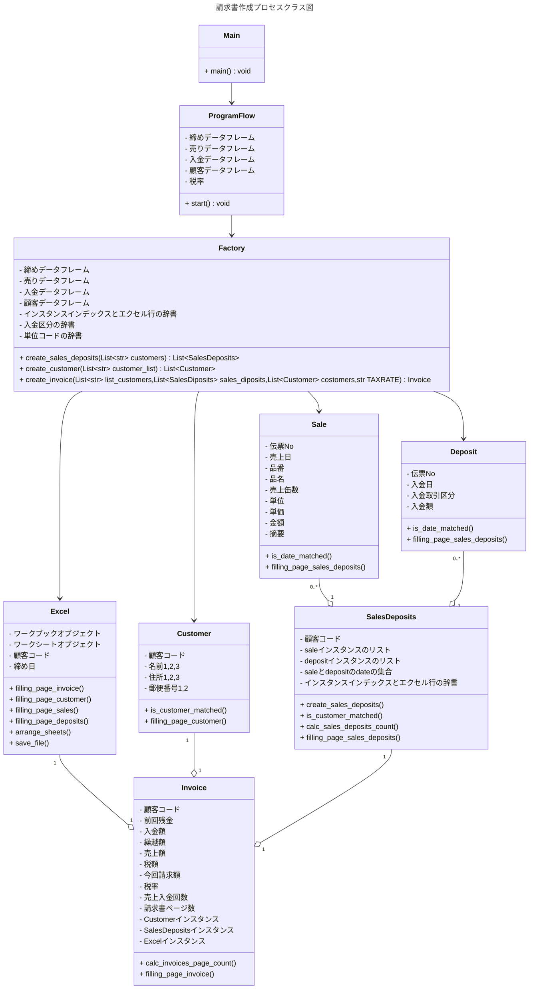
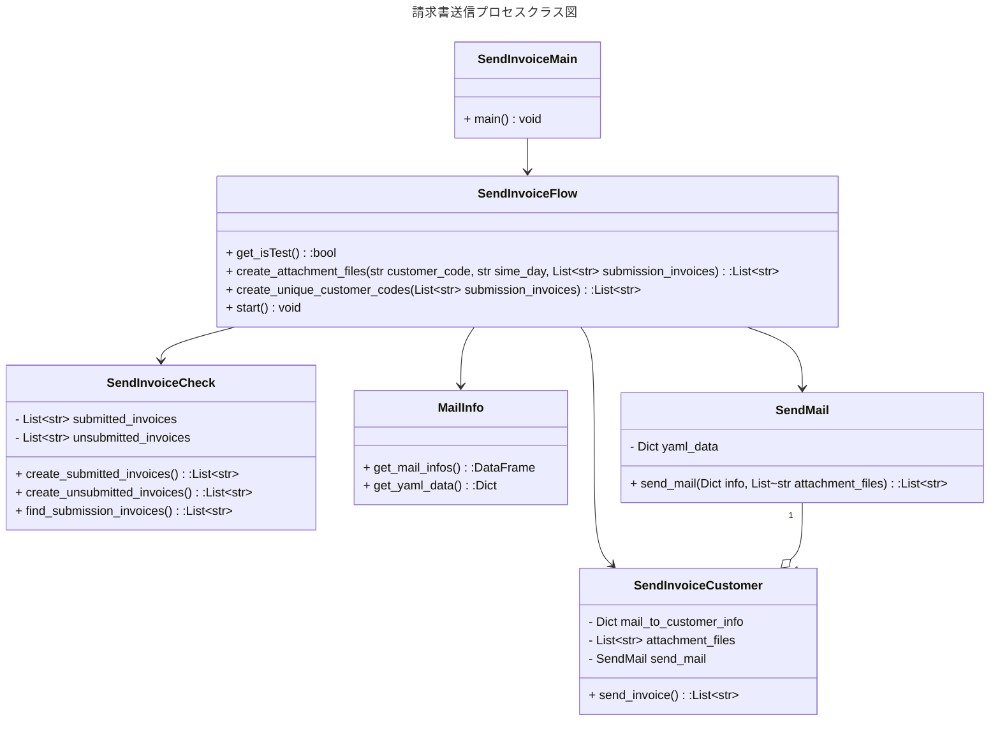

# 請求書自動作成発行システムについて
## システム概要
### 動作環境
- OS  
    - Windows11(main.py,  send_invoice_main.py)
    - Linux~WSL2:Ubunts~(send_invoice_main.pyのみ動作)</br>
**Linuxでは請求書送信のみ、請求書作成はWindows11しかうまく動かない**
- インストール先
    - 松戸PC(toyo-pc04)
    - 尾頭PC(toyo-pc12) WSL2(Ubuntu)で開発
### 構築システム
- メインシステム: Python3.10
- Windowsスクリプト(請求書作成: i.bat, 請求書送信: si.bat)
### ソースコード
GitHub Publicリポジトリで公開</br>
[GitHub_ https://github.com/ogashira/invoice](https://github.com/ogashira/invoice)

| 請求書作成プロセス | クラス名      | 請求書送信プロセス        | クラス名            |
| :---               | :---          | :---                      | :---                |
|  main.py           | 起点          | send_invoice_main.py      | 起点                |
|  program_flow.py   | ProgramFlow   | send_invoice_flow.py      | SendInvoiceFlow     |
|  factory.py        | Factory       | send_invoice_check.py     | SendInvoiceCheck    |
|  sale.py           | Sale          | send_invoice_mail_info.py | MailInfo            |
|  deposit.py        | Deposit       | send_invoice_send_mail.py | SendMail            |
|  sales_deposits.py | SalesDeposits | send_invoice_customer.py  | SendInvoiceCustomer |
|  invoice.py        | Invoice       |                           |                     |
|  customer.py       | Customer      |                           |                     |
|  excel.py          | Excel         |                           |                     |
|  sql_query.py      | SqlBTSZAN,</br> SqlRURIDT,</br> SqlRNYUKN,</br> SqlMTOKUI |  |  |
  
### 起動方法
##### 請求書作成プロセス
- `Winボタン+R -> i 入力 -> Enter`または`invoice/program`デイレクトリ内にて`python main.py`で実行
- **テストの場合**:  `Winボタン+R -> i test 入力 -> Enter`または`invoice/program`デイレクトリ内にて`python main.py test`で実行 -> `\\192.168.1.247\共有\営業課ﾌｫﾙﾀﾞ\02請求書\01Master\test_email_address.xlsx`の情報から請求書が作成される
##### 請求書送信プロセス
- `Winボタン+R -> si 入力 -> Enter`または`invoice/program`デイレクトリ内にて`python send_invoice_main.py`で実行 -> `\\192.168.1.247\共有\営業課ﾌｫﾙﾀﾞ\02請求書\01Master\test_email_address.xlsx`のアドレスに送信される
- **テストの場合**:  `Winボタン+R -> si test 入力 -> Enter`または`invoice/program`デイレクトリ内にて`python send_invoice_main.py test`で実行 -> `\\192.168.1.247\共有\営業課ﾌｫﾙﾀﾞ\02請求書\01Master\test_email_address.xlsx`のアドレスに送信される

### 動作
```
ディレクトリ構造
営業課ﾌｫﾙﾀﾞ
    |-02請求書
    |     |─ 01Master
    |     |     |- invoice_format.xlsx   # 請求書のエクセルフォーマット
    |     |     |- invoice.yaml          # Excel行、入金区分、メールアドレスなどのyamlファイル
    |     |     |- email_address.xlsx    # 得意先情報(emailAddress,請求書のケースに応じた送信可否情報)
    |     |     |- test_email_address.xlsx     # 上記のテスト用(送信先は社内)
    |     |─ 02Excel
    |     |     |─ 20251020
    |     |     |─ 20251025
    |     |     |─ 20251031
    |     |            |─ 20251031_T0020.xlsx
    |     |            |─ 20251031_T0060.xlsx
    |     |            |─ 20251031_T0100.xlsx
    |     |─ 03Pdf
    |     |     |─ 20251020
    |     |     |─ 20251025
    |     |     |─ 20251031
    |     |            |─01未提出
    |     |            |     |─ 20251031_T0020_y_.pdf  # 送信が成功すると02提出済フォルダに移動する
    |     |            |     |─ 20251031_T0060_y_.pdf  
    |     |            |     |─ 20251031_T0100_y_.pdf
    |     |            |     |─ 20251031_T2230_n_.pdf  # "_n_" が付くファイルは送信されない
    |     |            |
    |     |            |─02提出済
    |     |            |     |─ 20251031_T0020_y_.pdf
    |     |            |     |─ 20251031_T0060_y_.pdf
    |     |            |     |─ 20251031_T0100_y_.pdf
```
##### 請求書作成プロセス
1. 請求書作成プロセススタート(i.bat)でpythonが締め日を訊いてくる
1. 締め日入力(20251031)してEnter
1. `営業課ﾌｫﾙﾀﾞ/02請求書/02Excel/`内に`20251031`フォルダが作られ、そのフォルダの中に10/31締めの顧客の請求書(excelファイル)が作られる。(`締め日_得意先CD_.xlsx`)
1. 同時に、`営業課ﾌｫﾙﾀﾞ/02請求書/03Pdf/内に20251031`フォルダとフォルダ内に`01未提出, 02提出済`フォルダがそれぞれ作られる。
1. `締め日_得意先CD_.xlsx`はpdfに変換されるが、その時`email_address.xlsx`を参照して、請求書を送信するか否かを判断する。
1. 送信する請求書のファイル名の末尾に`"_y_"`を、送信しない場合は`"_n_"`を付加する。(`締め日_得意先CD_y_.pdf`または`締め日_得意先CD_n_.pdf`)そして`01未提出`フォルダに保存する。
##### 請求書送信プロセス
1. 請求書送信プロセススタート(si.bat)でpythonが締め日を訊いてくる
1. 締め日入力(20251031)してEnter
1. `02請求書/03Pdf/20251031/01未提出`と`02請求書/03Pdf/20251031/02提出済`を調べて、まだ提出されていない`"_y_"`の付いたpdfファイルを選出し、提出が必要な請求書としてコンソールに表示し、メール送信を行う。(送信元のEmail設定は`\\192.168.1.247\共有\技術課ﾌｫﾙﾀﾞ\200. effit_data\ﾏｽﾀ\coaﾒｰﾙ送信関連/mail_info.yaml`に記載)

1. メール送信が成功したpdfファイルは`01未提出`フォルダから`02提出済`フォルダに移動される。
1. 送信成功したpdfファイルがコンソールに表示される。
1. 一連の動作で表示された経過は`02請求書/03Pdf/20251031/invoice_log.txt`に保存される。
###### 追加の請求書がある場合
- `<任意の名前>_<得意先CD>_y_.pdf(例：10-31追加_T2880_y_.pdf)`として`01未提出`フォルダに入れておくと、pdfファイルを複数添付して送信してくれる。ファイル数は何個でもOK。ただし、命名方法は必ず以下に従うこと。
    - <任意の名前>は何文字でもOKだが、`_`を使ってはダメ。
    - <任意の名前>と<得意先CD>は必ず`_`でつなぐこと。
    - <得意先CD>の後には`_y_.pdf`で終わらせること。

## クラス図っぽいやつ(日本語概念)


## 仕様説明
##### 請求書作成プロセス
- MainクラスはProgramFlowクラスをインスタンス化してstartメソッドを呼び出す。
- ProgramFlowはsql_query.pyにあるSqlBTSZAN(締めデータ),SqlRURIDT(売上データ),SqlRNYUKN(入金データ),SqlMTOKUI(得意先マスタデータ)クラスを使ってsqlデータをeffitAサーバーからfetchする。pandasのDataFrameを利用する。SQLServerに接続する時のID,PassWordは``\\192.168.1.247\共有\技術課ﾌｫﾙﾀﾞ\ﾏｸﾛ\init\sqlForVba.ini``ファイルに書かれている内容を参照する。
- 入手したデータをFactoryクラスに渡す。Factoryクラスでは渡されたDataFrameを使って、Sale, Deposit, SalesDeposits, Customer, Invoiceクラスのインスタンスを生成する。
- 顧客ごとにSaleインスタンスとDepositインスタンスを生成し、それらインスタンスのリストをSalesDepositクラスが保持する。
- SalesDepositクラスの中では、SaleインスタンスリストとDepositインスタンスリストからSales_Depositインスタンスのリストを作る。このリストは売上日または入金日が昇順になるようにソートされる。また、このクラスはSales_depositインスタンスの順番(index)とエクセルの行で構成されたdictionaryを持っている。このdictionaryはyamlファイルを参照して作る。`営業課ﾌｫﾙﾀﾞ/02請求書/01Master/invoice.yaml`
- InvoiceクラスはCustomerクラスのインスタンスとSalesDepositsクラスのインスタンスとExcelクラスのインスタンスを保持している。
- 全てのクラスはsetterやgetterを持っていないので、インスタンス変数の中身は誰も分からない（自分自身しか知らない）
- Invoiceクラスのfilling_page_invoiceメソッドを呼び出すと、InvoiceインスタンスがExcelクラスインスタンスに自分が持っている情報を書き込む。自分の書き込みが終わると、ExcelクラスインスタンスをCustomerインスタンスに渡して、Customerインスタンスが自分がもっている情報をExcelインスタンスに書き込む。同様に、Saleクラス、DepositクラスにExcelインスタンスを渡して、自分自身の情報を書いてもらう。
- 全てのインスタンスがExcelインスタンスに書き終わった時点で、１件のinvoice(請求書)が出来上がるので、「締め日_顧客コード.xlsx」として所定のフォルダに保存する。
- InvoiceクラスのインスタンスはProgramFrowクラスstartメソッドの中でリストとして存在しているので for invoice in invoices: でイテレータとして連続して請求書が作られていく。
##### 請求書送信プロセス
- SendInvoiceMainからSendInvoiceFlowクラスを呼び出し、startメソッドで順次処理する。
- SendInvoiceCheckクラスで`01未提出`フォルダ`02提出済`フォルダ を調べて、提出が必要な請求書群(subbission_invoices)を作る
- SendInvoiceCustomerクラスは得意先CD,得意先のmailAddress情報(mail_to_customer_info)、送信する請求書のpath(attachment_files)、SendMailクラスのインスタンスを持つ
- SendInvoiceFlowクラスのstartメソッドで作られるSendInvoiceCustomerクラスのインスタンスのリストから、For文でsend_invoiceメソッドを呼べば、MailSendクラスのインスタンスが持つsend_mailメソッドを使って順次メールを送信する。
- SendMailインスタンスのsend_mailメソッドの戻り値がsuccess_send_mail(送信成功した請求書のpath)になっているのでそれをリストに詰めて、コンソールに表示する。
